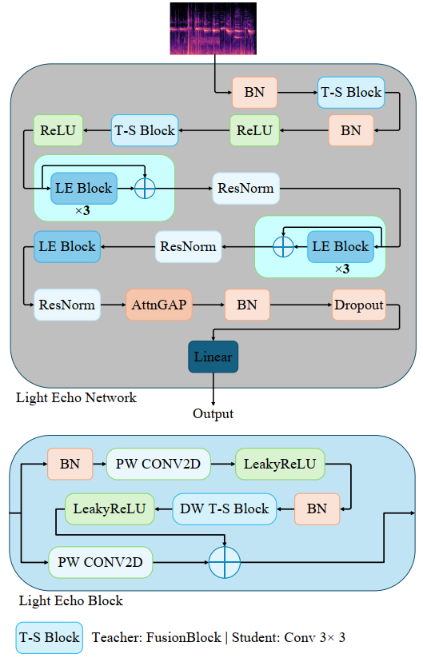
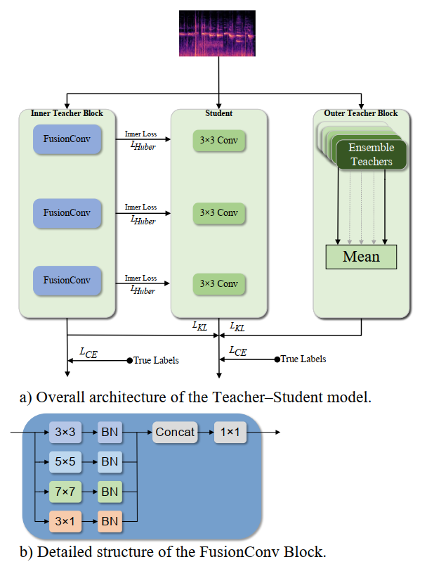
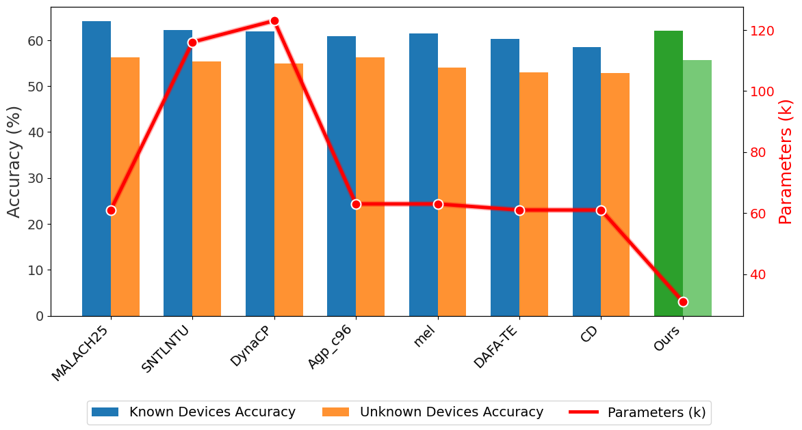
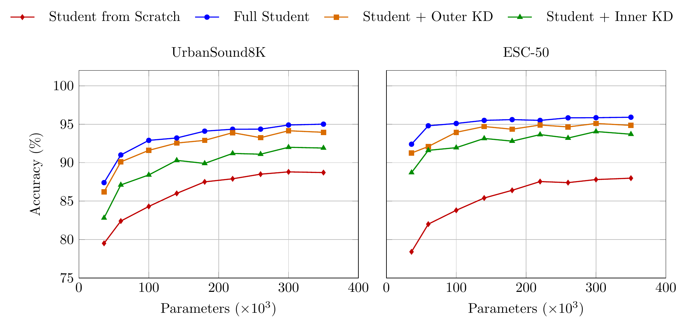

# Lightweight-Audio-Distillation
Lightweight audio classification framework achieving state-of-the-art or highly competitive results across multiple benchmarks while using dramatically fewer parameters and computational resources, enabling accurate and efficient deployment on resource-constrained and edge devices.

## Key Results

| Dataset | Accuracy | Parameters | FP16 Size |
|---|---:|---:|---:|
| **TAU Urban Acoustic Scenes** | **60.24%** | **31.2K** | **62.5 KB** |
| **ESC-50** | **93.4%** | **36.4K** | **72.8 KB** |
| **UrbanSound8K** | **94.43%** | **31.2K** | **62.5 KB** |

For a one-second TAU input, the deployed model requires only:

- **31.2K parameters**
- **28.6 MMACs**
- **62.5 KB in FP16**

On the low-complexity TAU benchmark, the compact configuration reaches **60.2% accuracy with only 31.2K parameters**, outperforming the compared low-complexity systems while using approximately half the parameters of the smallest competing system.

On the DCASE 2025 official evaluation setup, the system reaches:

- **62.3% overall accuracy**
- **64.3% on known devices**
- **58.4% on unknown devices**

while exceeding the first-ranked comparison system by **0.7 percentage points** with roughly half as many parameters.

---

## Highlights

- **31.2K parameters** for the compact 10-class model
- **62.5 KB** model size in FP16
- **28.6 MMACs** for a one-second audio clip
- **60.24%** accuracy on TAU
- **93.4%** accuracy on ESC-50
- **94.43%** accuracy on UrbanSound8K
- **62.3%** on the DCASE 2025 official evaluation setup
- Large gains over training the same student from scratch
- Projection-free intermediate feature matching
- Temperature-scaled logit distillation
- Normalized Huber feature supervision
- Multi-model teacher supervision
- Device-robust audio augmentation
- No auxiliary network required during inference
- FP16 deployment with negligible accuracy degradation
- Scales from approximately **31K to 350K parameters**

---

# Overview

The core goal is simple:

> Make training powerful while keeping inference extremely small.

During training, the compact student receives supervision from both structurally aligned intermediate representations and stronger output distributions.

```text
Higher-Capacity Aligned Network
            │
            ├── Intermediate Feature Supervision
            │
            └── Logit Supervision
            │
            ▼
       Compact Student
            │
            ▼
 Strong External Teachers
            │
            └── Logit / Ensemble Supervision
            │
            ▼
     Final Compact Student
            │
            ▼
         Deployment
```

All auxiliary networks are discarded after training.

---

# Architecture

The framework uses two structurally related CNNs during the first training stages:

- a higher-capacity aligned network
- a compact student

They preserve:

- the same overall stage organization
- compatible intermediate feature dimensions
- explicitly aligned convolution positions

This allows direct intermediate supervision without adding learned projection layers.

For the 10-class configuration, the student uses approximately **77% fewer parameters** than the aligned training network.

## Architecture Diagram

---

# Lightweight Backbone

The compact CNN contains:

- a two-layer stem
- Light Echo blocks
- pointwise convolutions
- depthwise convolutions
- residual connections
- Residual Normalization
- aligned convolution positions
- attention-based global pooling
- batch normalization
- dropout
- a final linear classifier

## Light Echo Block

```text
Input
  │
  ├── Pointwise Conv
  │
  ├── LeakyReLU
  │
  ├── Depthwise Conv
  │
  ├── BatchNorm
  │
  ├── LeakyReLU
  │
  ├── Pointwise Conv
  │
  └── Residual / Projection Connection
```

The pointwise-depthwise residual structure keeps computation low while preserving useful representation capacity.

---

# Structural Alignment

The larger training network is intentionally aligned with the student.

At selected positions:

```text
Higher-Capacity Network        Compact Student
-----------------------        ---------------
FusionConv           <---->    3×3 Conv
FusionConv           <---->    3×3 Conv
FusionConv           <---->    3×3 Conv
FusionConv           <---->    3×3 Conv
...
```

Nine student `3×3` convolution positions are replaced by higher-capacity **FusionConv** blocks.

Because the aligned outputs keep compatible dimensions, feature matching can be applied directly:

```text
Aligned Feature ─────┐
                     ├── Feature Loss
Student Feature ─────┘
```

No learned projection layer is required.

---

# FusionConv

FusionConv increases training-time capacity using multiple receptive-field sizes.

```text
                    ┌── 3×3 Conv ── BN ──┐
                    │                     │
                    ├── 5×5 Conv ── BN ──┤
Input ──────────────┤                     ├── Concat ── 1×1 Conv ── Output
                    ├── 7×7 Conv ── BN ──┤
                    │                     │
                    └── 3×1 Conv ── BN ──┘
```

This gives the aligned network richer feature extraction while maintaining compatibility with the compact student.

---

# Full Training Pipeline

Original figure path:

```text
images/StPlusKnwldge_figure3.pdf
```

[Open the training pipeline diagram](images/StPlusKnwldge_figure3.pdf)

For inline GitHub rendering, export the same figure as PNG and use:

```markdown

```

---

# Staged Training

Training is separated into three stages instead of optimizing all supervision signals at once.

```text
Stage I
Train the aligned higher-capacity model
        │
        ▼
Stage II
Train compact student using:
    • labels
    • aligned logits
    • normalized intermediate features
        │
        ▼
Stage III
Train compact student using:
    • labels
    • stronger external teacher logits
    • teacher ensemble
        │
        ▼
Final Compact Student
```

This separates **representation transfer** from **strong output-level transfer**.

---

# Distillation Formulation

Let:

- $\mathbf{z}_s$ denote the student logits
- $\mathbf{z}_i$ denote the aligned-network logits
- $\mathbf{z}_o$ denote the logits from one external teacher
- $\mathbf{z}_k$ denote the logits from external teacher $k$
- $T$ denote the distillation temperature

## External Teacher Distribution

For a single teacher:

$$p_o^T = \mathrm{softmax}\left(\frac{\mathbf{z}_o}{T}\right)$$

For an ensemble of $K$ teachers:

$$p_o^T = \frac{1}{K}\sum_{k=1}^{K}\mathrm{softmax}\left(\frac{\mathbf{z}_k}{T}\right)$$

The ensemble averages **temperature-scaled probability distributions**, not hard predictions.

---

# Active Teacher and Student Distributions

During the aligned-supervision stage, the active teacher distribution is:

$$p_t^T = \mathrm{softmax}\left(\frac{\mathbf{z}_i}{T}\right)$$

During the external-teacher stage, the active teacher distribution is:

$$p_t^T = p_o^T$$

The student distribution is:

$$p_s^T = \mathrm{softmax}\left(\frac{\mathbf{z}_s}{T}\right)$$

This allows the same general distillation objective to switch supervision sources across training stages.

---

# Intermediate Feature Supervision

Let $\mathcal{S}$ denote the set of selected aligned layers.

Four feature-matching positions are used:

$$|\mathcal{S}| = 4$$

This corresponds to roughly one feature-loss location for every two FusionConv blocks.

Adding more feature-supervision points did not improve accuracy and increased training time.

---

# Feature Normalization

Before computing the feature loss, student and aligned-network features are L2-normalized.

For the student:

$$\widehat{\mathbf{F}}_{s}^{(l)} = \frac{\mathbf{F}_{s}^{(l)}}{\lVert\mathbf{F}_{s}^{(l)}\rVert_2 + \varepsilon}$$

For the aligned network:

$$\widehat{\mathbf{F}}_{i}^{(l)} = \frac{\mathbf{F}_{i}^{(l)}}{\lVert\mathbf{F}_{i}^{(l)}\rVert_2 + \varepsilon}$$

Normalization reduces raw feature-scale differences and focuses the loss more strongly on representation structure.

---

# Huber Feature Matching

The feature objective can be written in two compact steps.

Average across selected aligned layers:

$$\mathcal{L}_{\mathrm{feat}} = \frac{1}{|\mathcal{S}|}\sum_{l\in\mathcal{S}}\mathcal{L}_{\mathrm{feat}}^{(l)}$$

Feature loss at layer $l$:

$$\mathcal{L}_{\mathrm{feat}}^{(l)} = \frac{1}{N_l}\sum_{j=1}^{N_l}\rho_{\delta}\left(\widehat{f}_{s,j}^{(l)}-\mathrm{sg}\left(\widehat{f}_{i,j}^{(l)}\right)\right)$$

where:

- $N_l$ is the number of elements in feature map $l$
- $\mathrm{sg}(\cdot)$ stops gradients through the aligned network
- $\varepsilon$ prevents numerical instability
- $\delta = 1$

For $|u| \leq \delta$, the Huber function is:

$$\rho_{\delta}(u) = \frac{1}{2}u^2$$

For $|u| > \delta$:

$$\rho_{\delta}(u) = \delta\left(|u|-\frac{\delta}{2}\right)$$

Huber loss behaves quadratically for smaller mismatches and linearly for larger mismatches, making feature supervision less sensitive to large outliers than pure MSE.

---

# Complete Training Objective

The compact student is trained with:

$$\mathcal{L} = (1-\alpha)\mathcal{L}_{\mathrm{CE}}(\mathbf{z}_s,y) + \alpha T^2\mathcal{L}_{\mathrm{KL}}\left(p_t^T\,\|\,p_s^T\right) + \beta\mathcal{L}_{\mathrm{feat}}$$

The loss contains three components.

## 1. Ground-Truth Classification Loss

$$\mathcal{L}_{\mathrm{label}} = (1-\alpha)\mathcal{L}_{\mathrm{CE}}(\mathbf{z}_s,y)$$

Cross-entropy keeps the compact model directly tied to the true labels.

## 2. Teacher Logit Supervision

$$\mathcal{L}_{\mathrm{logit}} = \alpha T^2\mathcal{L}_{\mathrm{KL}}\left(p_t^T\,\|\,p_s^T\right)$$

KL divergence transfers the softer class relationships learned by the active teacher.

## 3. Intermediate Representation Supervision

$$\mathcal{L}_{\mathrm{feature}} = \beta\mathcal{L}_{\mathrm{feat}}$$

This encourages the student to reproduce useful intermediate representations from the aligned network.

## Loss Weights

| Parameter | Role |
|---|---|
| $\alpha$ | Balances ground-truth and teacher-logit supervision |
| $\beta$ | Controls intermediate feature supervision |
| $T$ | Softmax temperature used during distillation |

---

# Stage I — Aligned Model Training

The aligned higher-capacity network is trained first.

| Dataset | Epochs | Accuracy |
|---|---:|---:|
| TAU | 60 | 58.3% |
| ESC-50 | 51 | 86.6% |
| UrbanSound8K | 63 | 90.3% |

---

# Stage II — Feature + Logit Transfer

The compact student is trained using:

- ground-truth labels
- aligned logits
- normalized intermediate features
- Huber feature loss

The hyperparameters are:

$$\alpha = 0.6$$

$$\beta = 0.8$$

$$T = 5$$

Stage II results:

| Dataset | Epochs | Student Accuracy |
|---|---:|---:|
| TAU | 66 | 57.8% |
| ESC-50 | 68 | 86.5% |
| UrbanSound8K | 72 | 89.5% |

At this point, the compact student already approaches the performance of the larger aligned model.

---

# Stage III — Strong External Supervision

The final stage increases the contribution of stronger external teachers.

$$T = 8$$

$$\alpha = 0.95$$

$$\beta = 0$$

Since $\beta = 0$, intermediate feature matching is disabled during this stage:

$$\beta\mathcal{L}_{\mathrm{feat}} = 0$$

The objective reduces to:

$$\mathcal{L} = (1-\alpha) \mathcal{L}_{\mathrm{CE}} \left( \mathbf{z}_s,y \right) + \alpha T^2 \mathcal{L}_{\mathrm{KL}} \left( p_o^T \,\|\, p_s^T \right)$$

The final stage is therefore dominated by stronger teacher predictions while retaining a small amount of direct label supervision.

---

# Stage-Wise Results

| Stage | Trained Model | Epochs TAU / ESC-50 / US8K | TAU | ESC-50 | UrbanSound8K |
|---|---|---:|---:|---:|---:|
| I | Aligned model | 60 / 51 / 63 | 58.3% | 86.6% | 90.3% |
| II | Student | 66 / 68 / 72 | 57.8% | 86.5% | 89.5% |
| III | Student | 51 / 65 / 52 | **60.3%** | **93.5%** | **94.5%** |

After FP16 conversion:

| Dataset | FP16 Accuracy Drop |
|---|---:|
| TAU | ~0.10 percentage points |
| ESC-50 | ~0.08 percentage points |
| UrbanSound8K | ~0.12 percentage points |

Final deployed results:

| Dataset | Final Accuracy |
|---|---:|
| TAU | **60.24%** |
| ESC-50 | **93.4%** |
| UrbanSound8K | **94.43%** |

---

# Input Processing

All audio is converted to:

```text
Mono
32 kHz
```

Mel-spectrogram extraction uses:

| Setting | Value |
|---|---:|
| Sampling rate | 32 kHz |
| FFT size | 4096 |
| Hop length | 502 |
| Mel bins | 256 |
| Power exponent | 2.0 |
| Dynamic range | 80 dB |

Resulting feature dimensions:

| Dataset | Mel Spectrogram Shape |
|---|---:|
| TAU | 256 × 64 |
| UrbanSound8K | 256 × 255 |
| ESC-50 | 256 × 319 |

For UrbanSound8K:

- clips shorter than four seconds are zero-padded
- clips longer than four seconds are trimmed

---

# Data Augmentation

The training pipeline combines offline and online augmentation.

## Offline Augmentation

Microphone impulse-response augmentation is used to improve robustness to recording-device differences.

## Online Augmentation

During training, the pipeline applies:

- time masking
- frequency masking
- random gain
- additive Gaussian noise
- MixStyle
- impulse-response augmentation

These transformations improve robustness to device mismatch, background interference, and acoustic variation.

---

# Optimization

| Setting | Value |
|---|---:|
| Optimizer | Adam |
| Initial learning rate | `1e-3` |
| Batch size | 64 |
| Learning-rate schedule | Cosine annealing |
| Validation split for early stopping | 20% |
| Random seed | Fixed |
| Training GPU | RTX 3090, 24 GB |

Training stops when validation accuracy no longer improves.

---

# Complexity and Distillation Ablation

| Dataset | Aligned MMACs | Aligned Params | Aligned Size | Student MMACs | Student Params | Student Size | Scratch | External KD | No Feature Loss | No Feature Norm. | **Full** |
|---|---:|---:|---:|---:|---:|---:|---:|---:|---:|---:|---:|
| TAU | 144.6 | 140.1K | 273.7 KB | **28.6** | **31.2K** | **62.5 KB** | 54.1 | 59.1 | 59.9 | 60.0 | **60.2** |
| ESC-50 | 722.9 | 145.3K | 283.8 KB | **143.2** | **36.4K** | **72.8 KB** | 79.2 | 89.8 | 91.5 | 92.7 | **93.4** |
| UrbanSound8K | 578.3 | 140.1K | 273.7 KB | **114.5** | **31.2K** | **62.5 KB** | 80.0 | 92.2 | 93.1 | 94.3 | **94.4** |

---

# Gain Over Training from Scratch

| Dataset | Scratch | Full Training | Absolute Gain |
|---|---:|---:|---:|
| TAU | 54.1% | **60.2%** | **+6.1 pp** |
| ESC-50 | 79.2% | **93.4%** | **+14.2 pp** |
| UrbanSound8K | 80.0% | **94.4%** | **+14.4 pp** |

These gains are obtained **without changing the deployed student's inference architecture**.

---

# Importance of Intermediate Supervision

| Dataset | External KD Only | No Feature Loss | No Feature Normalization | **Full** |
|---|---:|---:|---:|---:|
| TAU | 59.1 | 59.9 | 60.0 | **60.2** |
| ESC-50 | 89.8 | 91.5 | 92.7 | **93.4** |
| UrbanSound8K | 92.2 | 93.1 | 94.3 | **94.4** |

Both structural alignment and normalized feature supervision contribute to final accuracy.

---

# Feature-Loss Ablation

| Dataset | L1 | **Huber** | Cosine | Normalized MSE | KL | MSE |
|---|---:|---:|---:|---:|---:|---:|
| TAU | 56.4 | **57.8** | 56.2 | 55.3 | 54.7 | 56.8 |
| ESC-50 | 85.2 | **86.5** | 84.4 | 83.3 | 84.7 | 84.8 |
| UrbanSound8K | 87.8 | **89.5** | 85.5 | 87.9 | 84.6 | 86.9 |

Huber produces the strongest result across all three datasets.

---

# External Teacher Ensemble

Five teacher configurations are used in the final ensemble:

- LEN-v1
- LEN-v2
- CP-Mobile
- CPResNet
- HTS-AT

Their temperature-scaled probability distributions are averaged.

For ESC-50 and UrbanSound8K, the larger teacher models are initialized from large-scale audio pretraining and then fine-tuned on the target folds.

---

# Teacher Selection Results

## TAU

| Teacher | Teacher Accuracy | Student Accuracy | Student Drop Without Aligned Stage |
|---|---:|---:|---:|
| LEN-v1 | 57.1 | 56.4 | 3.4 pp |
| LEN-v2 | 55.8 | 56.2 | 2.6 pp |
| CP-Mobile | 54.3 | 55.1 | 3.7 pp |
| CPResNet | 51.9 | 53.4 | 3.2 pp |
| HTS-AT | 52.1 | 53.3 | 4.1 pp |
| **Ensemble** | **63.6** | **60.2** | **1.1 pp** |

## ESC-50

| Teacher | Teacher Accuracy | Student Accuracy | Student Drop Without Aligned Stage |
|---|---:|---:|---:|
| LEN-v1 | 89.2 | 88.2 | 4.0 pp |
| LEN-v2 | 86.0 | 86.8 | 4.3 pp |
| CP-Mobile | 88.9 | 88.3 | 4.1 pp |
| CPResNet | 87.6 | 87.7 | 4.2 pp |
| HTS-AT | 93.5 | 90.1 | 3.9 pp |
| **Ensemble** | **96.6** | **93.4** | **3.6 pp** |

## UrbanSound8K

| Teacher | Teacher Accuracy | Student Accuracy | Student Drop Without Aligned Stage |
|---|---:|---:|---:|
| LEN-v1 | 90.1 | 90.0 | 3.5 pp |
| LEN-v2 | 86.3 | 88.2 | 3.7 pp |
| CP-Mobile | 91.2 | 90.9 | 3.3 pp |
| CPResNet | 90.0 | 89.1 | 3.5 pp |
| HTS-AT | 95.8 | 93.6 | 2.6 pp |
| **Ensemble** | **97.3** | **94.4** | **2.2 pp** |

---

# Low-Complexity TAU Comparison

| System | Accuracy | Parameters | MMACs | Model Size | Precision |
|---|---:|---:|---:|---:|---:|
| Baseline | 51.5% | 61.1K | 29.42 | 122.30 KB | 16-bit |
| Ens-Gui-St | 59.9% | 60.0K | 30.00 | 121.0 KB | 16-bit |
| TFSN | 58.1% | 126.9K | 29.42 | 507.43 KB | 32-bit |
| Linear-C | 59.1% | 63.9K | 29.84 | 127.75 KB | 16-bit |
| NEPUMSE | 58.3% | 107.5K | **16.91** | 429.83 KB | 32-bit |
| **This framework** | **60.2%** | **31.2K** | 28.60 | **62.52 KB** | 16-bit |

Compared with the smallest competing system in this table:

```text
Parameters
60.0K  →  31.2K

Model size
121.0 KB  →  62.5 KB

Accuracy
59.9%  →  60.2%
```

The compact configuration is therefore **smaller while also achieving higher accuracy** in this comparison.

---

# DCASE 2025 Evaluation

| Device Group | Accuracy |
|---|---:|
| **Overall** | **62.3%** |
| Known Devices | **64.3%** |
| Unknown Devices | **58.4%** |

The system exceeds the first-ranked comparison by **0.7 percentage points** while using approximately half as many parameters.



Original figure path:

```text
images/Dcase2025.png
```

---

# ESC-50 and UrbanSound8K Comparison

| Model | Maximum Parameters | ESC-50 | UrbanSound8K |
|---|---:|---:|---:|
| BEATs iter3 | 300M | 95.6 | 86.1 |
| Dasheng 0.6B | 600M | 88.2 | 85.8 |
| MATPAC++ | 86M | 93.1 | 89.7 |
| M2D-CLAP | 149M | **97.9** | 89.7 |
| ITFA-DNN | 2M | 94.2 | 95.3 |
| SpectroMaskNet | 2.7M | 95.50 | **96.32** |
| AudioPG | 86M | 90.60 | 88.17 |
| PP-KD | 5.18M | 83.80 | 81.90 |
| S-SONDO | 8.70M | 91.90 | 86.20 |
| SSATKD | 12.3K | 82.65 | — |
| Micro CNN-PSK | 50.8K | 86.50 | 84.52 |
| MQaKD | 208.6K | 80.03 | 94.95 |
| **Compact configuration** | **~36K** | **93.4 ± 0.9** | **94.4 ± 1.9** |
| **350K configuration** | **350K** | **95.8 ± 0.83** | **96.25 ± 1.72** |

The compact configuration reaches **93.4% on ESC-50** and **94.4% on UrbanSound8K** with only tens of thousands of parameters.

The larger 350K configuration reaches:

- **95.8% on ESC-50**
- **96.25% on UrbanSound8K**

while remaining much smaller than many systems with millions or hundreds of millions of parameters.

---

# Parameter Scaling

Increasing student depth and the corresponding aligned-network capacity generally improves accuracy.

The gains begin to saturate around:

- **230K parameters on ESC-50**
- **300K parameters on UrbanSound8K**

Original scaling-figure source:

```text
my_plot2.tex
```

[Open parameter-scaling source](my_plot2.tex)

Because GitHub cannot render a PGFPlots `.tex` file inline, export it to an image if you want it visible directly in the README:

```markdown

```

---

# Compact and Higher-Capacity Configurations

## Ultra-Compact Configuration

Approximately **31K–36K parameters**.

| Dataset | Accuracy |
|---|---:|
| TAU | **60.24%** |
| ESC-50 | **93.4%** |
| UrbanSound8K | **94.43%** |

This configuration is intended for systems where storage, memory, and computation are tightly constrained.

## 350K Configuration

| Dataset | Accuracy |
|---|---:|
| ESC-50 | **95.8 ± 0.83%** |
| UrbanSound8K | **96.25 ± 1.72%** |

This provides a higher-capacity option while remaining far smaller than many conventional audio classifiers.

---

# FP16 Deployment

For the compact 10-class configuration:

```text
Parameters : 31.2K
FP16 Size  : ~62.5 KB
```

Observed FP16 accuracy reductions:

| Dataset | Accuracy Drop |
|---|---:|
| TAU | ~0.10 pp |
| ESC-50 | ~0.08 pp |
| UrbanSound8K | ~0.12 pp |

Suitable deployment targets include:

- embedded audio systems
- edge devices
- wearables
- mobile inference
- low-memory environments
- always-on acoustic monitoring
- resource-constrained hardware

---

# Why It Works

The final performance comes from combining several complementary ideas.

## Structural Compatibility

The larger aligned network and the student expose compatible intermediate feature dimensions, avoiding the architectural mismatch that often makes intermediate distillation difficult.

## Higher Training-Time Capacity

FusionConv increases feature capacity during training without increasing the deployed model size.

## Representation Transfer First

The student first learns stronger intermediate representations:

```text
Aligned Network
      │
      ├── Features
      └── Logits
      │
      ▼
   Student
```

## Stronger Output Transfer Later

After the representation stage, stronger external teachers refine the class distribution:

```text
External Teachers
       │
       ▼
Temperature Scaling
       │
       ▼
Probability Averaging
       │
       ▼
Compact Student
```

## Feature Normalization

L2 normalization reduces raw activation-scale differences before feature matching.

## Huber Matching

Huber loss is more robust to large feature mismatches than pure squared error, and it produced the best feature-loss ablation result on all three datasets.

## Temperature-Scaled Knowledge Transfer

Softened class distributions expose relationships between classes that hard labels do not provide.

## Teacher Ensembles

Averaging several softened teacher distributions produces a stronger supervision target.

## No Deployment-Time Auxiliary Cost

```text
TRAINING

Aligned Model
      +
External Teachers
      +
Compact Student
      │
      ▼
Knowledge Transfer
      │
      ▼

DEPLOYMENT

Compact Student Only
```

The final student keeps the same inference architecture and computational cost after training.

---

# Final Summary

The compact configuration reaches:

| Dataset | Accuracy |
|---|---:|
| **TAU** | **60.24%** |
| **ESC-50** | **93.4%** |
| **UrbanSound8K** | **94.43%** |

with only:

```text
31.2K parameters
28.6 MMACs for a one-second TAU input
62.5 KB in FP16
```

The overall strategy is:

```text
Structural Alignment
        +
Intermediate Feature Matching
        +
L2 Feature Normalization
        +
Huber Loss
        +
Temperature-Scaled Logit Distillation
        +
External Teacher Ensemble
        +
Staged Optimization
        │
        ▼
Tiny High-Accuracy Audio Classifier
```

The result is a compact audio-classification system that achieves **state-of-the-art low-complexity performance on TAU** and highly competitive results on ESC-50 and UrbanSound8K while using dramatically fewer parameters than many larger alternatives.
